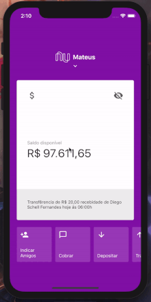

<!-- PROJECT SHIELDS -->

<!-- PROJECT LOGO -->
 

  

  <h3 align="center">Nubank App</h3>

<!-- ABOUT THE PROJECT -->

## Sobre o Projeto

Projeto feito durante o tutorial do Diego da Rocktseat.

 

  
  

  <h3 align="center">Template Rocketseat Basic</h3>

